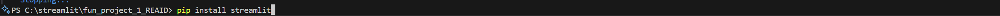
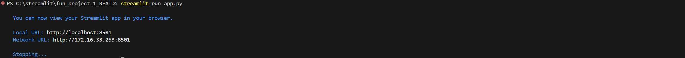

# FUN_PROJECT_1_REAID
## How to Run this project
- install streamlit on this project using command below

### Make sure you on the project directory ‼️‼️
- Then you can run this project by type this command below

🔗 **Link Deployment**:  
⚠️ *COMING SOON*
